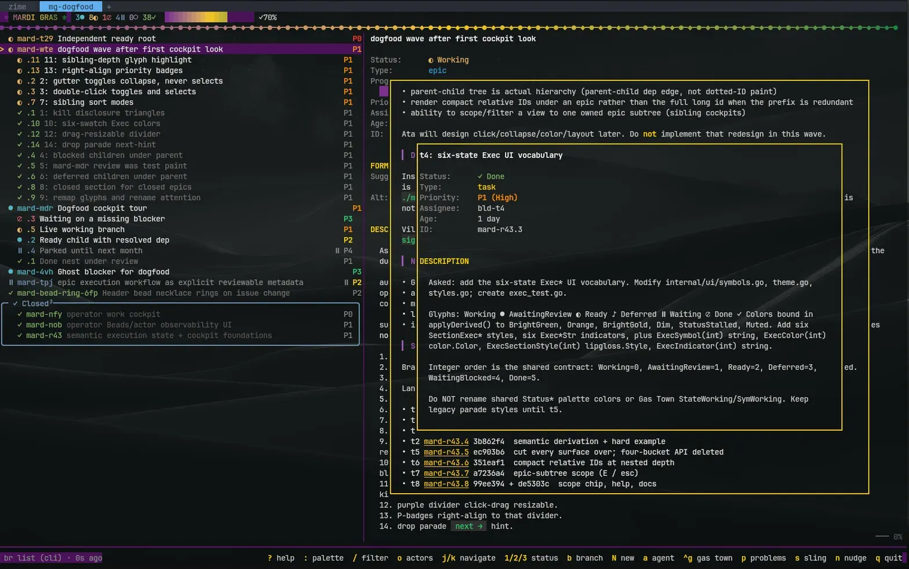
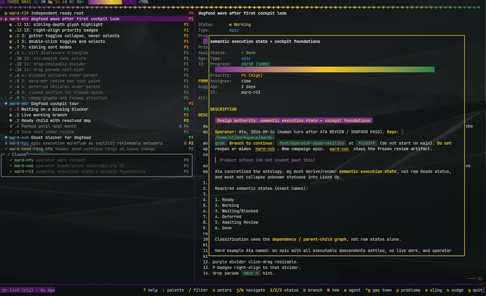
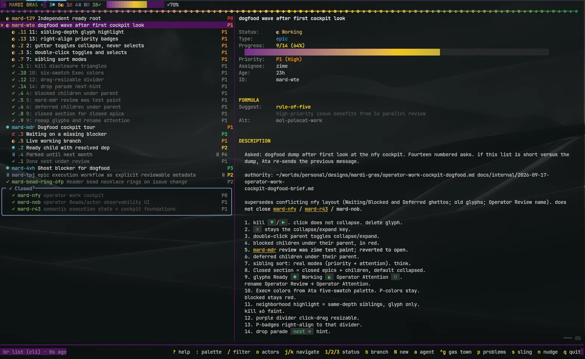
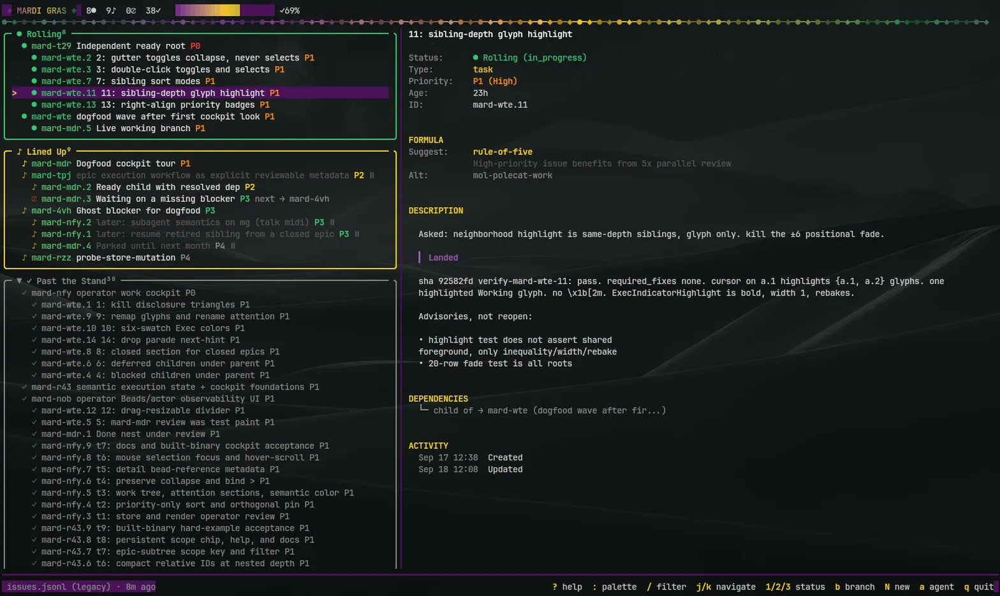

# ⚜ Mardi Gras

## This fork

This is the `mg` we actually run: [`atacolak/mardi-gras`](https://github.com/atacolak/mardi-gras) on `main`. Upstream Mardi Gras is a Beads parade aimed at `bd`. This fork is an operator work cockpit: `br` is first-class, the tree stays a tree, and the mouse can reach the beads.

The difference is easiest to see. Upstream still dumps the board into carnival buckets (Rolling / Lined Up / Past the Stand) with a faded, hard-to-scan list. Here children live under their epic, blocked and deferred rows stay with their parent, closed epics tuck into a Closed section, and the selected family's status glyphs stay full color while everyone else recedes (the old ±6 faint, on the glyph only). The top of the screen is only the bead necklace; the old `⚜ MARDI GRAS ⚜` tally / progress line is gone. When a bead changes, that necklace rings for about 600ms. The purple divider is drag-resizable and keeps its left/right percentage when the terminal zooms. Previews are ours: we keep moving them — scrollable gold overlays, a nest of two, click the first to pop the second, a tighter right gap so the box sits balanced.

```bash
git clone https://github.com/atacolak/mardi-gras.git
cd mardi-gras
make build      # → ./mg
```

### After

The live cockpit, a preview, and a nested preview:







### Before (upstream)



### Opinionated changes

**Semantic execution, not raw Beads status.** Every surface derives one of six named states from the issue graph: Ready `●`, Working `◐`, Waiting/Blocked `⊘`, Deferred `⏸`, Operator Attention `○`, Done `✓`. Unknown statuses stay unmapped instead of collapsing into Lined Up. Operator Attention is a real stored Beads `review` status — closing children does not auto-promote an epic.

**A parent-child forest.** The parade follows parent-child edges, not dotted-ID paint. Nested rows show compact relative IDs (`.7` under `mard-nob`) when the prefix is redundant. `E` scopes the view to an owned epic subtree. Blocked and deferred children render under their parent. Closed epics (and their families) live in a Closed section, collapsed by default; click the header `╭─` to open it.

**Sibling sort is two independent knobs.** `S` cycles epics; `s` cycles beads. Each project stores the pair in `.beads/mg.json` so a reopen resumes it.

- **attention** (default) — Operator Attention, blocked, working, ready, deferred, done; then priority; then id
- **priority** — P0 first, then id
- **chronological** — created_at (older first), then natural bead-id so .2 precedes .10

**Parade chrome we actually want.** No disclosure triangles. Click the left gutter to collapse a parent without selecting it; double-click a parent to collapse/expand and select it. The selected epic family's glyphs stay full color; the rest recede — glyph only, no underline, no positional row fade. Priority badges right-align to the divider, with nested rows inset by the same indent. The purple middle divider is click-drag resizable and remembers the split as a percentage, so a 70/30 zoom-in stays 70/30 when you zoom out. Exec colors follow a six-swatch palette. The old parade next-blocker hint is gone. Done titles are shaded; the Closed box is steel. An epic with children shows that count as a superscript on its status glyph (`◐²`) — the same direct-child total as the detail `Progress:` line. The header is the bead necklace alone; when work changes it spins for ~600ms (16 frames × 40ms).

**A mouse that reaches the beads — and previews we keep moving.** Click a row to select it and focus the pane under the pointer. Wheel scrolls that pane. Bead IDs in markdown bodies are clickable, including one sitting against a sentence period (`mard-nob.`); DEPENDENCIES IDs are gold-underlined and clickable too (closed beads link if they're loaded). Ctrl or Ctrl-click — on a body ID or a left-hand parade row — opens a scrollable gold preview (stack of two). Wheel on a preview scrolls that preview; leftover ticks at its edge pass to the preview that opened it, then the parent bead. Click the first preview's visible body to dismiss the nested one; click the parent body to close the stack. Wheel in the gap around the overlays scrolls the parent. The overlay is inset equally left and right (three extra columns of the old right gap went into the box).

**`br` is first-class.** This fork prefers `br list --json` (schema 17, `br` 0.5.x) and grafts graph edges back from `.beads/issues.jsonl` so parent-child and blockers still work. `bd` still runs if that is what you have. Upstream `mg` is `bd`-shaped; we do not treat `bd` as the operator path.

**Cockpit plumbing, with honest WIP.** Collapse state survives rebuilds. Hover-scroll and pane focus are first-class. The footer reports the real Beads CLI (`br`). The actors pane (`o`) is still WIP — a read-only sketch of who is live and what they own. Do not build process around it yet. Gas City invariants are on the way out; we are going to remove them soon rather than keep a second orchestrator personality in the cockpit.

The original Mardi Gras README continues below for install options, the sixty-second tour, and upstream context.


[](https://github.com/quietpublish/mardi-gras/actions/workflows/ci.yml)
[](https://github.com/quietpublish/mardi-gras/releases/latest)
[](https://go.dev/)
[](https://github.com/gastownhall/beads)
[](https://github.com/gastownhall/gastown)
[](https://github.com/gastownhall/gascity)
[](LICENSE)
[](https://codecov.io/gh/quietpublish/mardi-gras)

**Your Beads issues deserve a parade, not a spreadsheet.**

Mardi Gras (`mg`) is a terminal UI for [Beads](https://github.com/gastownhall/beads), the issue tracker built for coding agents. It reads the same issues your agents write and shows them as a work cockpit: what's being worked, what's waiting on you, what's ready to pick up, what's parked, what's blocked, what's under operator review, and what's done. When something changes, the work tree reshuffles in front of you.

One static binary. No daemon, no config file. Run `mg` in a Beads project and you're watching.

<!-- Demo GIF: regenerate with `make demo-gif` (drives the fake Gas City supervisor via testdata/vhs/demo.tape) -->


## The parade

Every issue is on the route somewhere:

```
●  Ready              open, nothing in its way, not deferred
◐  Working            in progress, with live work under it
⊘  Waiting/Blocked    waiting on something that isn't done yet
⏸  Deferred           parked until its defer date passes
○  Operator Attention work is finished; operator acceptance is pending
✓  Done               closed, nested under its parent
```

The tree is honest. Work is priority-sorted in one tree: Ready, Working, Operator Attention, and Done stay together under their parent, while Waiting/Blocked and Deferred appear as attention sections when needed. A Waiting/Blocked row names what it's waiting on. Children nest under their parents, and a nested row prints the short form of its ID — `.7` under the epic `mard-nob` — whenever the full prefix would only repeat the parent sitting directly above it. Overdue work says so, in red. The header keeps a running tally and a progress bar, and the footer tells you where the data came from and how fresh it is.

Operator Attention is an explicit stored Beads state. The lead moves an epic into it with `br update <epic> --status review`; `review` is absent from Ready. Closing children does not automatically enter review.

Blocked is computed from dependency edges, not from a status field somebody forgot to update. `blocks` and `conditional-blocks` count by default; widen that with `--block-types` if your project uses others.

`E` scopes the parade to the selected issue's epic subtree — the epic and everything beneath it — and `esc` clears it (scope first, then focus mode, then back to the parade). Scoping is live: it stacks on top of whatever filter and focus mode you already have instead of resetting them. While the footer is the bar on screen it holds a `⚜ SCOPE <epic-id>` chip for as long as the scope is on, including when the scope has no rows left to show. So a scope pointed at an epic your other filters have since dropped out reads as deliberately empty rather than broken — as long as you can see the chip. A filter query, a bulk-selection prompt, or an open input bar takes over the bottom row and the chip goes with it; in the filter case the `N/M match` count is the cue instead.

## Why this exists

Beads gives agents a durable memory of the work. `bd list` is fine for an agent. For a human doing morning triage, it's a wall of text.

The usual fix is a web dashboard or a kanban port. Mardi Gras takes a different view: work is motion. Things move, wait, get stuck, and pass. A parade shows that. Columns don't.

And if you're going to stare at your tasks every day, they should at least make you smile.

## Install

**Homebrew** (macOS and Linux)

```bash
brew install matt-wright86/homebrew-tap/mardi-gras
```

**Go**

```bash
go install github.com/matt-wright86/mardi-gras/cmd/mg@latest
```

> Make sure `~/go/bin` is on your `PATH` ahead of `/usr/bin`. macOS ships a `/usr/bin/mg` (micro-emacs) that will shadow the binary otherwise.

**Binaries** for Linux, macOS, and Windows on amd64 and arm64 are on the [Releases](https://github.com/quietpublish/mardi-gras/releases) page.

**From source**

```bash
git clone https://github.com/atacolak/mardi-gras.git
cd mardi-gras
make build      # → ./mg
```

You need a Beads project. This fork talks to `br` first. `bd` still works if that is the binary on `PATH`. Without either, mg falls back to reading `.beads/issues.jsonl`. Homebrew / `go install` of upstream still get `bd`-first `mg` — clone this repo for the cockpit.

## Sixty seconds in

```bash
cd your-project
mg
```

| Key | What happens |
| --- | --- |
| `j` / `k` | Move along the route |
| `enter` | Open the detail pane for the selected issue |
| `o` | Actor pane (WIP, read-only sketch — do not depend on it yet) |
| `S` | Cycle epic sort: attention → priority → chronological |
| `s` | Cycle bead sort: attention → priority → chronological |
| `/` | Filter: free text, plus `type:bug`, `priority:high`, `label:backend` |
| `f` | Focus mode: your work and the top priorities, nothing else |
| `E` | Scope to selected epic subtree |
| `esc` | Clear scope first, then existing focus behavior |
| `>` | Collapse or expand the selected branch |
| `click` | Select a bead and focus the pane under the pointer |
| `wheel` | Move the pane under the pointer |
| `:` or `ctrl+k` | Command palette, with everything mg can do |
| `?` | Help overlay, paged by section |
| `q` | Leave the parade |

Press `?` for the rest. The [full keybinding reference](docs/keybindings.md) lists every shortcut across the parade, detail pane, actor society pane, orchestrator panel, and overlays.

## What you can do

### Read

The detail pane renders an issue's description, design notes, and acceptance criteria as real markdown. It shows dependencies in both directions, an epic's progress through its children, comments and the timeline, how old the issue is, and when work on it started. With an orchestrator attached it also suggests a formula for the work and, on Gas Town, draws the molecule DAG with the critical path picked out.

`o` opens the actor society pane in the same slot: one row per persistent actor with its kind, lifecycle, readiness, the sprint it owns, and what it was asked and is doing now. `v` flips between this project and the whole village. It is strictly read-only — the pane reports, it never restores, recycles, or messages anyone — and it is absent entirely when the `actor` CLI is not installed.

### Act

Writes go through the `bd` CLI, so anything mg changes is exactly what an agent would see.

- `1` `2` `3` set status; `!` `@` `#` `$` set priority.
- `N` creates an issue, `e` edits it, `r` adds a comment, `y` assigns it, `t` labels it, `l` links a dependency.
- `b` copies a branch name for the issue; `B` creates and checks out that branch.
- `space` builds a multi-selection; the status and priority keys then apply to all of it.
- `3` on a single issue closes it and claims the next ready issue in one step.
- `D` opens a `bd doctor` overlay when something about the workspace looks off.

### Launch agents

`a` starts an AI coding agent on the selected issue. [Claude Code](https://claude.com/claude-code), [Cursor](https://cursor.com), and [OpenAI Codex](https://github.com/openai/codex) are supported; mg picks the first one on your `PATH`, or you choose with `--agent`.

Inside tmux, the agent opens in a split pane beside the parade and mg remembers which pane belongs to which issue, so `a` again takes you back to it instead of starting a second one. `A` stops it.

`M` opens a live Codex transcript in place of the detail pane. mg speaks Codex's MCP protocol directly, streams messages, commands, and patches as they happen, and surfaces exec and patch approvals as a modal you answer without leaving the parade. `r` sends a follow-up prompt into the running session.

See the [agent integration guide](docs/agents.md) for runtime detection, tmux dispatch, and Codex specifics.

### Orchestrate

When an orchestrator is present, mg becomes a control surface for it. `ctrl+g` opens the panel: agent roster with live states, convoys, mail, cost dashboard, velocity, activity feed, and a problems view (`p`) that flags stalled agents, backoff loops, and zombie sessions. `a` slings the issue to an agent instead of opening a local one, `s` picks a formula first, `n` nudges the agent already on it, and `C` builds a convoy from an epic or a multi-selection.

Two backends are supported:

- **[Gas Town](https://github.com/gastownhall/gastown)** (`gt`), the default. Everything goes through the `gt` CLI.
- **[Gas City](https://github.com/gastownhall/gascity)** (`gc`), an orchestration-builder SDK from the same org. mg speaks its Supervisor HTTP API. Roster, mail, formulas, sling, assign, nudge, decommission, and convoys work; a few Gas Town-specific views don't, and mg hides those rather than failing.

mg picks a backend from evidence on the machine:

1. `MG_GC_API` is set → Gas City. You named it.
2. Any Gas Town evidence, a `GT_*` env var or `gt` on `PATH` → Gas Town.
3. No Gas Town evidence but Gas City evidence, `gc` on `PATH` or a `city.toml` up the tree → Gas City.
4. Nothing conclusive → Gas Town.

`MG_GC_API=auto` discovers the running supervisor; `MG_GC_CITY` pins which city to drive. The [Gas Town guide](docs/gastown.md) and [Gas City guide](docs/gascity.md) cover each feature set, and the Gas City guide includes the capability matrix.

## Options

```bash
mg                                      # auto-detect the Beads project you're in
mg --path ~/proj/.beads/issues.jsonl    # read a specific JSONL file
mg --block-types blocks,discovered-from # which dependency types count as blockers
mg --exclude-type epic,chore            # hide issue types from the parade
mg --exclude-label gt:agent             # hide issues carrying a label
mg --theme light                        # auto | dark | light
mg --agent codex                        # claude | cursor | codex
mg --cmd-timeout 60                     # seconds; scales every external command (default 30)
mg --no-animations                      # calm header, no confetti; good over SSH
mg --status                             # tmux status-line summary, then exit
mg --version
```

Every option has an environment variable so you can set it once: `MG_BLOCK_TYPES`, `MG_THEME`, `MG_AGENT_RUNTIME`, `MG_CMD_TIMEOUT`, `MG_NO_ANIMATIONS=1`. `MG_DEBUG=1` writes `mg-debug.log` in the current directory. `MG_GC_API` and `MG_GC_CITY` select the Gas City backend, as above.

## Live updates

mg polls. No file watchers, no daemon, no background service.

- With `bd` on `PATH`, it runs `bd list --json` every 5 seconds and checks the source's health every 15.
- Reading JSONL directly, it checks the file's modification time every 1.2 seconds.

Edits from agents, scripts, and `bd` commands all show up on the next tick. Your selection, filter, and fold state survive the refresh.

## Themes

mg ships a dark theme and a light one, and picks by asking the terminal for its background color. If your terminal doesn't answer, or you just want to be explicit, `--theme light` or `MG_THEME=light` settles it.


## tmux

**Status line.** A compact, color-coded count of all six execution states:

```bash
set -g status-right "#(mg --status)"
set -g status-right "#(mg --status --path ~/myproject/.beads/issues.jsonl)"   # a specific project
```

**Popup.** The whole parade on one key, sized to the terminal, in the current pane's directory:

```bash
bind m display-popup -E -w 80% -h 75% -d "#{pane_current_path}" "mg"
```

## Built with

[Bubble Tea v2](https://github.com/charmbracelet/bubbletea) for the Elm architecture, [Lip Gloss v2](https://github.com/charmbracelet/lipgloss) for the purple, gold, and green, [Bubbles v2](https://github.com/charmbracelet/bubbles) for the viewports, and [Glamour](https://github.com/charmbracelet/glamour) for the markdown. Single binary, no runtime dependencies, cross-compiled by [GoReleaser](https://goreleaser.com).

The [architecture overview](docs/ARCHITECTURE.md) explains how the pieces fit, including the driver seam that keeps orchestrators pluggable.

## What Mardi Gras is, and isn't

It is a lens on Beads. Beads stays the source of truth; mg never keeps state of its own, and everything it writes goes through `bd`.

It is not a project management system, not a kanban board, and not a sync layer. If you want those, Beads has an ecosystem. This is the part that makes you smile at 9am.

## Design principles

- Joy over minimalism
- Motion over columns
- Zero configuration
- Human-first visuals
- Beads remains the brain

## Contributing

The route is laid and the floats are rolling, but there's room for more krewes. [CONTRIBUTING.md](CONTRIBUTING.md) covers setup, the fake Gas Town and Gas City backends for local development, and conventions. Bug reports and PRs welcome.

## License

[MIT](LICENSE)

---

_Let the good tasks roll._ ⚜
